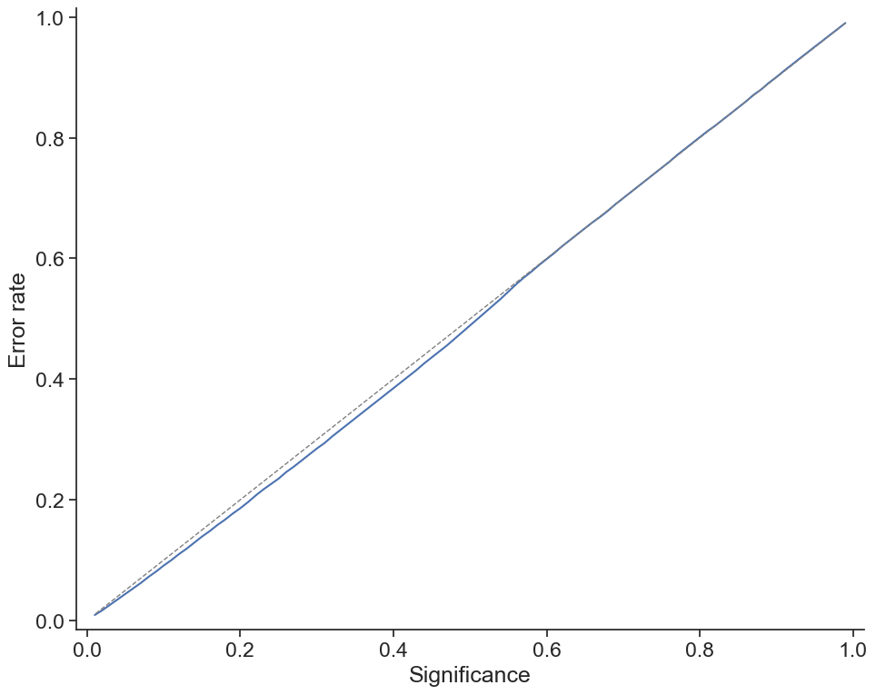
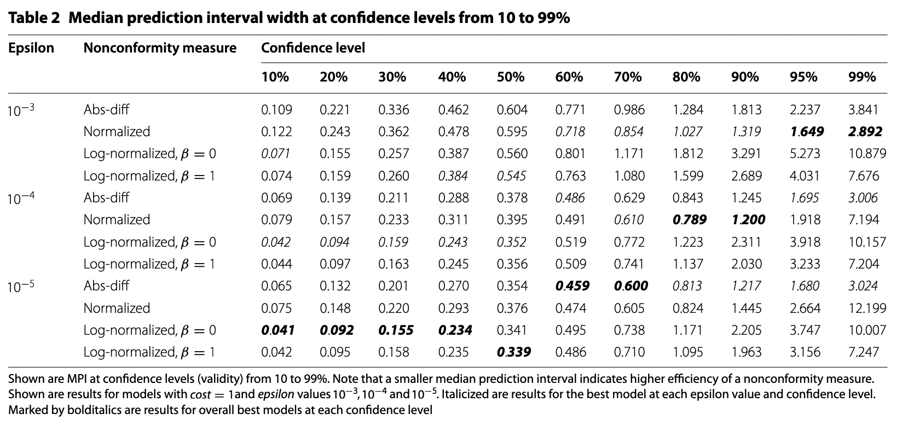
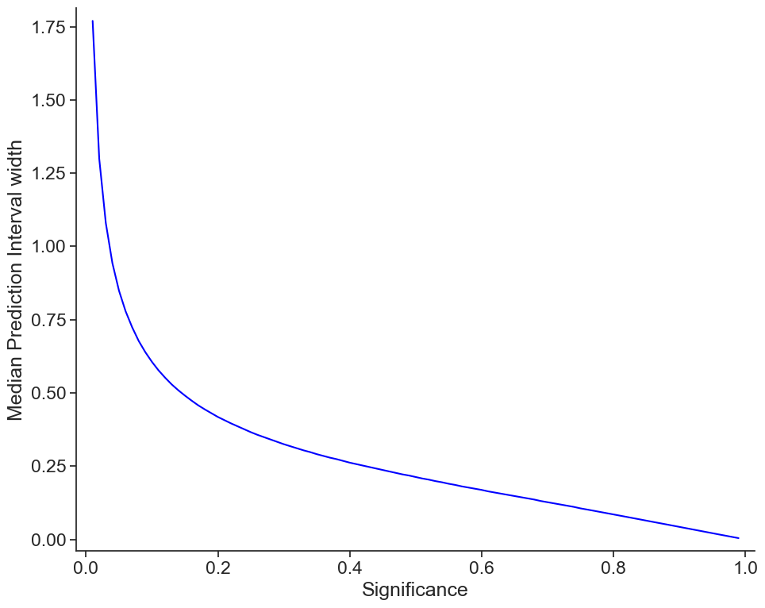

# cpLogD v2.0

This is a re-take of the cpLogD model previously published in [A confidence predictor for logD using conformal regression and a support-vector machine](https://link.springer.com/article/10.1186/s13321-018-0271-1). The main update is that it is based on a newer version of [ChEMBL](https://www.ebi.ac.uk/chembl/) (v33, May 2023), and that it is built using a later version of [CPSign](https://github.com/arosbio/cpsign) - which is now open source for non-commercial use. **Note: the old cpLogD was based on the computed property `acd_logd` in ChEMBL but which is no longer supplied, and have been replaced by the `CX LogD 7.4` property which was now used.**

The service is now publicly available at https://cplogd.serve.scilifelab.se/ and you can view the OpenAPI specification at https://cplogd.serve.scilifelab.se/api/openapi.json. 

## Steps for generation

### 1. Downloading data from ChEMBL

The latest version of ChEMBL (version 33) was downloaded from ChEMBL, and data was extracted following the procedure outlined in [download data](download_dataset/README.md). The extracted dataset can be found in the compressed file [cx_logd.csv.gz](download_dataset/cx_logd.csv.gz).

### 2. Model development and evaluation

How the modeling was performed is detailed in [train and evaluate model](train_and_evaluate_model/README.md). Model evaluation was performed in the same way as for the initial model, using a withheld dataset of 100,000 test compounds.

### 3. Docker image generation

To serve the model as Java web server with OpenAPI documented REST interface we copy the *trained-model.jar* that was generated in the last step into the [generate_service](generate_service/) directory and use the [Dockerfile](generate_service/Dockerfile) to build a local docker image. This image is based on the base containers from the [cpsign_predict_services](https://github.com/arosbio/cpsign_predict_services) repository. Follow the guide in that repo to publish your own service, or download our image from the [packages](https://github.com/pharmbio/cplogd-v2.0/pkgs/container/cplogd-v2.0) tab at GitHub if you wish to run it yourself.

## Model performance

Here we show the model performance for the new cpLogD model and compare it to the old model.

### Model calibration

The error rate exactly matches the significance level from 0.6 significance and above, and even produces slightly lower error rate for significance levels lower than 0.6. In short - this shows that the model is indeed well calibrated and the predictions can be trusted.

### Model efficiency

The original work compared different hyper-parameter settings and presented Median Prediction Interval (MPI) for a set of confidence levels:

Here are the MPI for the new (v2) model:

| 10%   | 20%   | 30%   | 40%   | 50%   | 60%   | 70%   | 80%   | 90%   | 95%   | 99%  |
|-------|-------|-------|-------|-------|-------|-------|-------|-------|-------|------|
| 0.043 | 0.085 | 0.127 | 0.169 | 0.213 | 0.262 | 0.325 | 0.418 | 0.606 | 0.849 | 1.77 |

The new model (v2) thus beats the old models (bold faced in the first table) at all significance levels except for 10% confidence where it only differs on the last digit. As stated in the original paper, confidence levels 70-99% are the most interesting, where the new model almost halves the MPI for confidence levels 70-95% and is about 40% smaller for 99% confidence. All results can be found in [validation_stats](train_and_evaluate_model/output/validation_stats.csv) file. For convenience we also plot these based on the significance level: 

### Accuracy of midpoint prediction

The original paper also presented the accuracy of the underlying SVM model, thus we present the same values here (**Q$^2$**=squared correlation coefficient, **RMSEP**=root mean square error of prediction):

|Model|Q$^2$ |RMSEP|
|--|--|--|
|v1 (old)|0.973|0.41|
|v2 (new)|0.984|0.315|

Our new model thus also improve the midpoint of the predictions, which is as expected as we have increased the size of the training data.